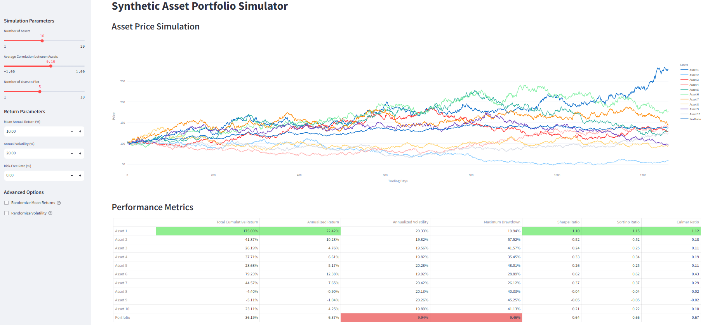

# Synthetic Asset Portfolio Simulator

This is a Python-based application that simulates asset prices in a portfolio, allowing you to explore correlations, returns, volatility, and portfolio performance. The app is interactive and easy to use for financial simulation purposes.




## Features

- **Simulate asset prices:** Generate asset price paths using random returns based on user-defined or randomized mean returns and volatility.
- **Adjustable correlation:** Control the average correlation between assets in the portfolio.
- **Custom parameters:** Set the number of assets, the number of years for the simulation, and return and volatility parameters.
- **Advanced options:** Randomize mean returns and volatility for each asset.
- **Performance metrics:** Analyze performance metrics such as Sharpe Ratio, Sortino Ratio, Calmar Ratio, Maximum Drawdown, and more.
- **Correlation matrix:** View and adjust the correlation matrix of assets.
- **Compare portfolios across correlations:** Evaluate portfolio performance with different correlation settings.

## Installation

1. **Clone the repository:**
   ```bash
   git clone https://github.com/your-username/PortfolioCorrelationsSimulator.git
   cd PortfolioCorrelationsSimulator
   ```

2. **Set up a virtual environment (optional but recommended):**
   ```bash
   python -m venv venv
   source venv/bin/activate  # On Windows use `venv\Scripts\activate`
   ```

3. **Install the required dependencies:**
   ```bash
   pip install -r requirements.txt
   ```

## How to Run

1. After installing the dependencies, you can run the app using Streamlit:
   ```bash
   streamlit run src/asset_correlation_app.py
   ```

2. This will start a local server. You can access the app by opening the URL provided in the terminal (usually `http://localhost:8501/`).

## Usage

- **Number of Assets:** Select how many assets you want in your portfolio.
- **Correlation:** Set the average correlation between assets, or let it vary randomly.
- **Simulation Length:** Choose how many years to simulate.
- **Return Parameters:** Customize the expected mean annual return and volatility for the assets.
- **Advanced Options:** Enable randomization of the mean returns and volatility across different assets.
- **Visualizations and Metrics:** The app displays the asset prices and calculates performance metrics for each asset and the portfolio.

## Dependencies

- Python 3.7+
- Streamlit
- NumPy
- Pandas
- Plotly

Install the dependencies using:
```bash
pip install -r requirements.txt
```

## License

This project is licensed under the MIT License - see the [LICENSE](LICENSE) file for details.

## Acknowledgments

- The application uses financial theories of asset returns, volatility, and correlation. Special thanks to the developers of [Streamlit](https://streamlit.io/), [NumPy](https://numpy.org/), [Pandas](https://pandas.pydata.org/), and [Plotly](https://plotly.com/) for the libraries that make this simulation possible.

---

Feel free to contribute by submitting issues or pull requests.
